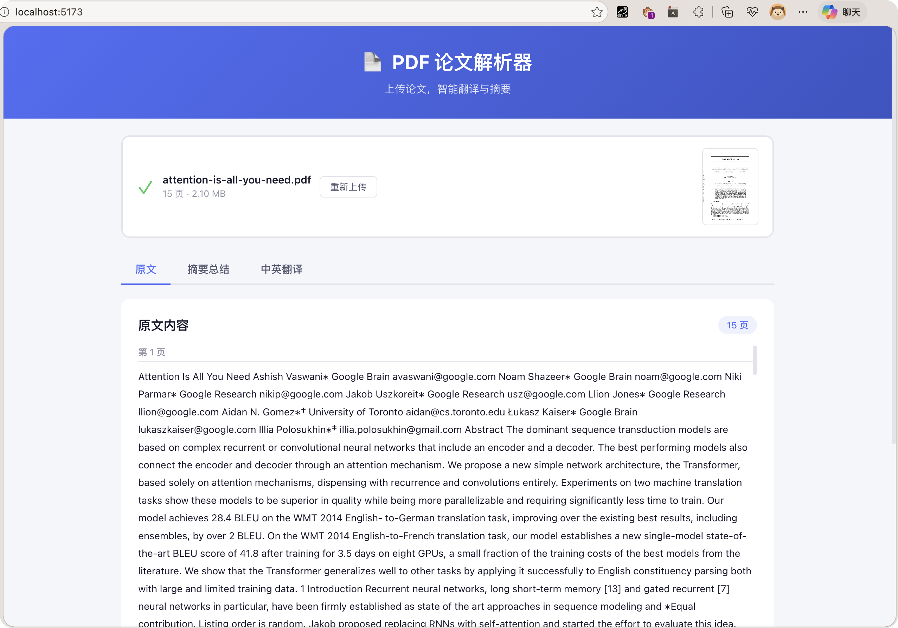
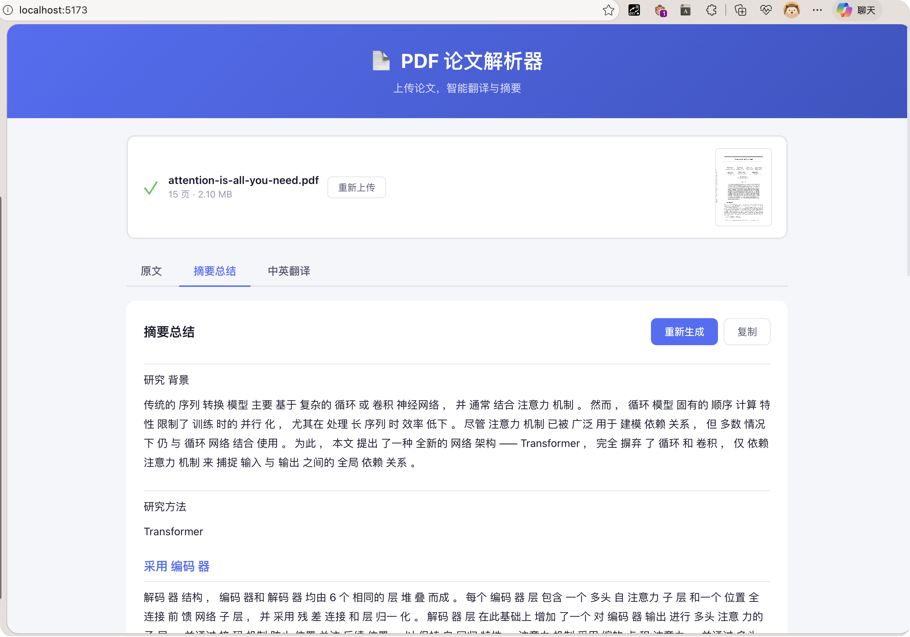
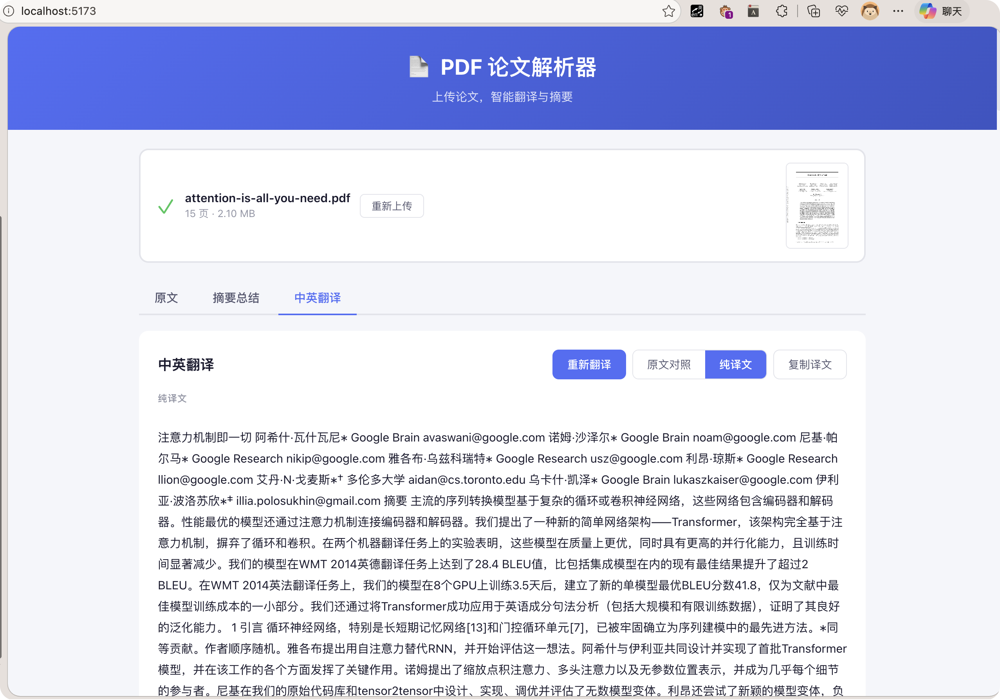
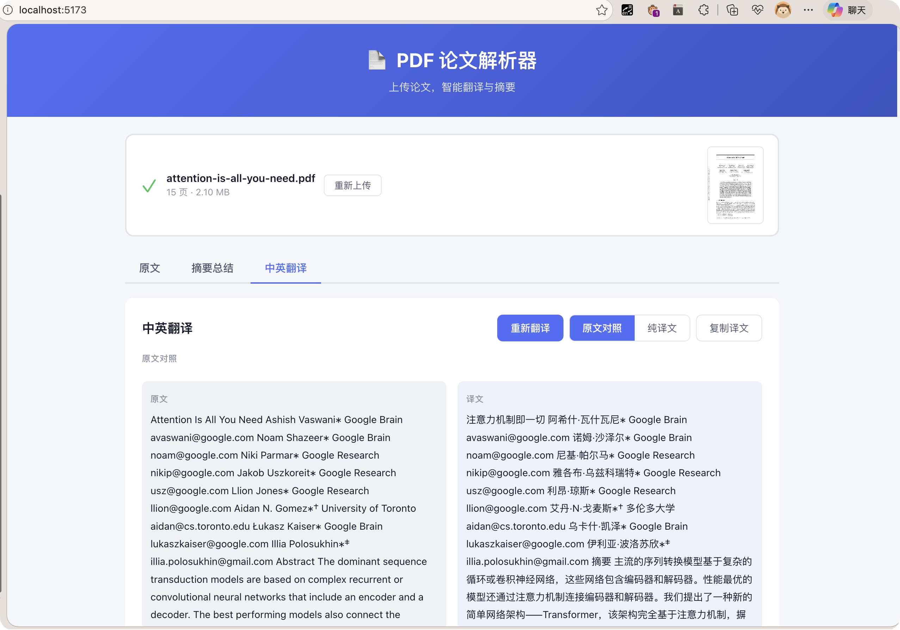
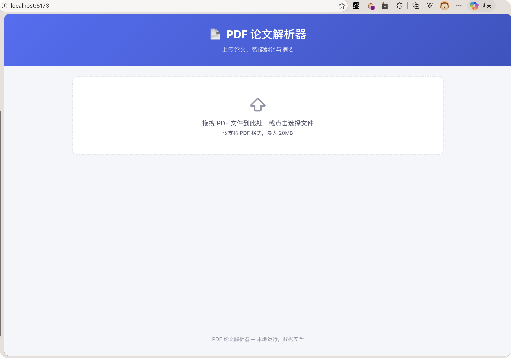

# PDF DeepSeek Parser

一个基于 FastAPI + Vue 3 的 PDF 论文解析器，支持智能摘要生成和双语翻译。

## 功能特性

- **PDF 解析**: 上传 PDF 文件，自动提取文本内容
- **智能摘要**: 基于 DeepSeek API 生成结构化论文摘要
- **双语翻译**: 逐段翻译英文论文为流畅中文
- **流式输出**: 实时流式返回 AI 生成内容
- **原文对照**: 支持原文/译文对照查看模式

## 技术栈

**后端**
- FastAPI
- PyMuPDF (PDF 解析)
- OpenAI SDK (对接 DeepSeek API)
- SSE (服务端推送)

**前端**
- Vue 3
- Vite
- marked (Markdown 渲染)

## 快速开始

### 1. 克隆项目

```bash
git clone https://github.com/aCoo4ie/pdf-deepseek-parser.git
cd pdf-deepseek-parser
```

### 2. 配置后端

```bash
cd backend
python -m venv venv
source venv/bin/activate  # Windows: venv\Scripts\activate
pip install -r requirements.txt
```

创建 `.env` 文件：

```env
DEEPSEEK_API_KEY=your_api_key_here
```

### 3. 启动后端服务

```bash
uvicorn main:app --reload --port 8000
```

后端服务运行在 http://localhost:8000

### 4. 配置并启动前端

```bash
cd frontend
npm install
npm run dev
```

前端服务运行在 http://localhost:5173

### 5. 访问应用

打开浏览器访问 http://localhost:5173

## 截图预览

### 首页 - 上传 PDF


### 原文阅读模式


### 摘要生成


### 翻译模式 - 原文对照


### 翻译模式 - 纯译文


## 项目结构

```
pdf-project/
├── backend/
│   ├── main.py              # FastAPI 应用入口
│   ├── config.py            # 配置文件
│   ├── requirements.txt    # Python 依赖
│   └── services/
│       ├── pdf_parser.py   # PDF 解析服务
│       └── llm_service.py   # LLM 调用服务
└── frontend/
    ├── index.html
    ├── package.json
    ├── vite.config.js
    └── src/
        ├── main.js
        ├── App.vue
        ├── style.css
        └── components/
            ├── FileUpload.vue
            ├── SummaryPanel.vue
            ├── TranslatePanel.vue
            └── LoadingSpinner.vue
```

## API 接口

| 接口 | 方法 | 描述 |
|------|------|------|
| `/api/upload` | POST | 上传并解析 PDF |
| `/api/summarize` | POST | 生成论文摘要 (SSE 流式) |
| `/api/translate` | POST | 翻译论文段落 (SSE 流式) |
| `/api/health` | GET | 健康检查 |

## 环境变量

| 变量 | 描述 | 默认值 |
|------|------|--------|
| `DEEPSEEK_API_KEY` | DeepSeek API 密钥 | 必填 |
| `MAX_UPLOAD_SIZE` | 最大上传文件大小 | 20MB |

## License

MIT License
